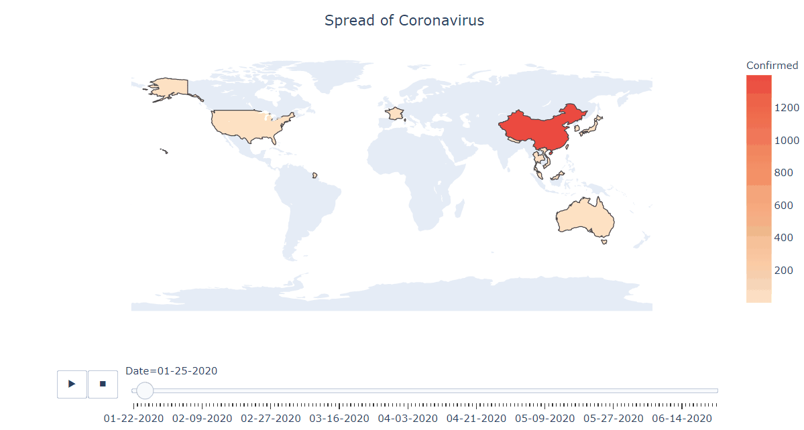
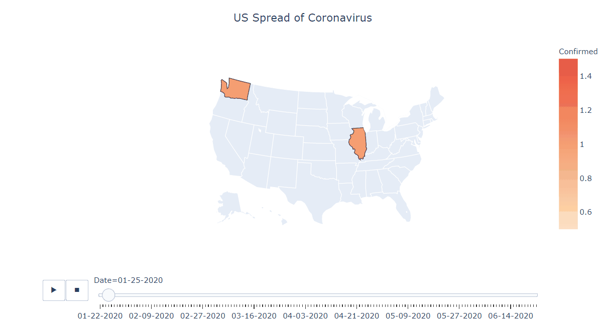

# Coronavirus Covid 19 visualizations and analysis 

We introduce different visualizations and analysis about Covid 19.
Our repository is based on the John Hopkins University Covid 19 data, updated every day.

<b>Contact Us: </b> 
* Email: bastinflorian1@gmail.com
  

  
<b>Data Sources:</b> 
* World Health Organization (WHO): https://www.who.int/  
* DXY.cn. Pneumonia. 2020. http://3g.dxy.cn/newh5/view/pneumonia.   
* BNO News: https://bnonews.com/index.php/2020/02/the-latest-coronavirus-cases/   
* National Health Commission of the People’s Republic of China (NHC):  
 http://www.nhc.gov.cn/xcs/yqtb/list_gzbd.shtml  
* China CDC (CCDC): http://weekly.chinacdc.cn/news/TrackingtheEpidemic.htm  
* Hong Kong Department of Health: https://www.chp.gov.hk/en/features/102465.html  
* Macau Government: https://www.ssm.gov.mo/portal/  
* Taiwan CDC: https://sites.google.com/cdc.gov.tw/2019ncov/taiwan?authuser=0  
* US CDC: https://www.cdc.gov/coronavirus/2019-ncov/index.html  
* Government of Canada: https://www.canada.ca/en/public-health/services/diseases/coronavirus.html  
* Australia Government Department of Health: https://www.health.gov.au/news/coronavirus-update-at-a-glance  
* European Centre for Disease Prevention and Control (ECDC): https://www.ecdc.europa.eu/en/geographical-distribution-2019-ncov-cases 
* Ministry of Health Singapore (MOH): https://www.moh.gov.sg/covid-19
* Italy Ministry of Health: http://www.salute.gov.it/nuovocoronavirus
* 1Point3Arces: https://coronavirus.1point3acres.com/en
* WorldoMeters: https://www.worldometers.info/coronavirus/
* COVID Tracking Project: https://covidtracking.com/data. (US Testing and Hospitalization Data. We use the maximum reported value from "Currently" and "Cumulative" Hospitalized for our hospitalization number report ed for each state.)
